# Dz-kitab Digital Library System Diagrams

## Diagram 1 - Database Entity Relationship

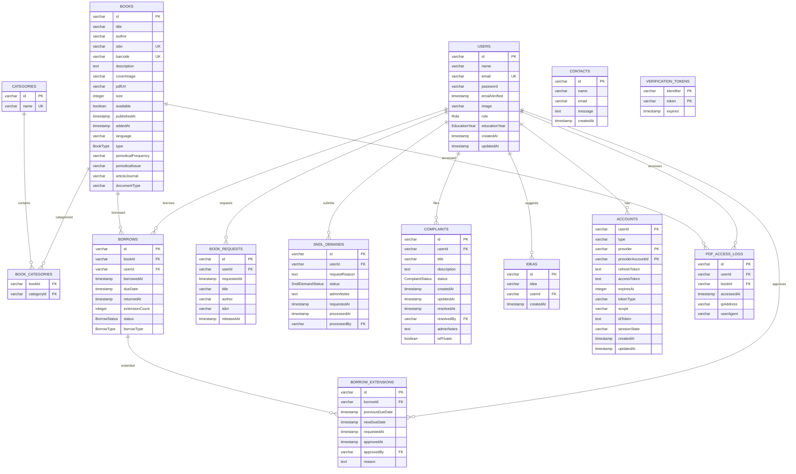

## Diagram 2 - Web Application Architecture

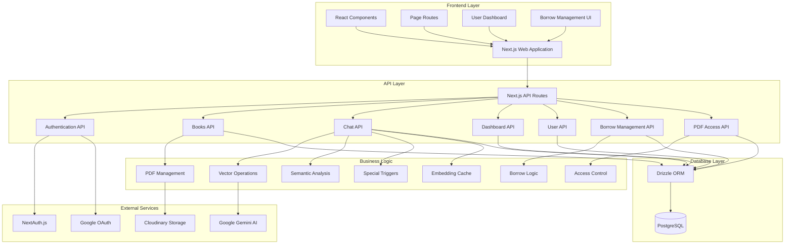

## Diagram 3 - Authentication Flow with @estin.dz Restriction

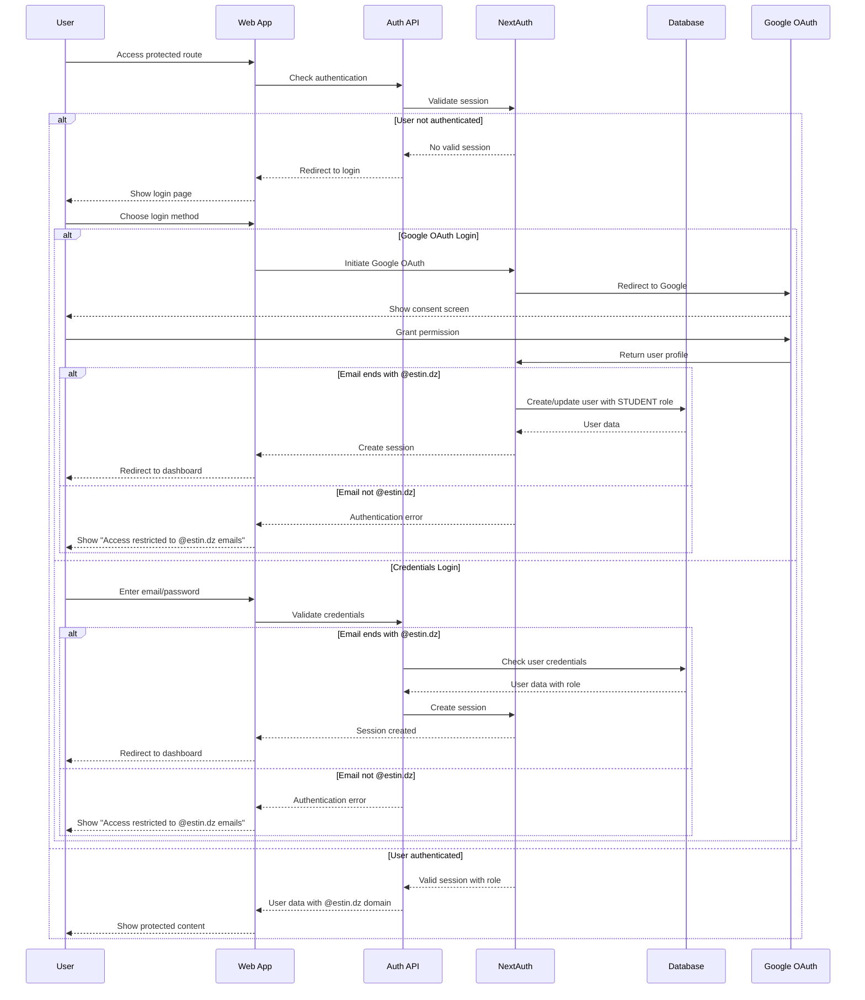

## Diagram 4 - PDF Access Flow (No Librarian Approval Required)

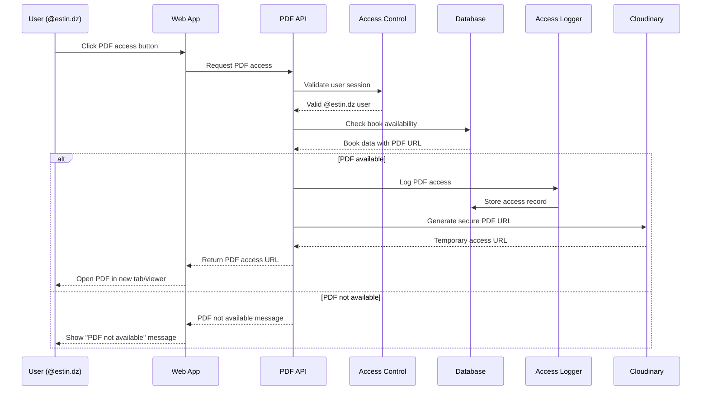

## Diagram 5 - Physical Book Borrowing Workflow

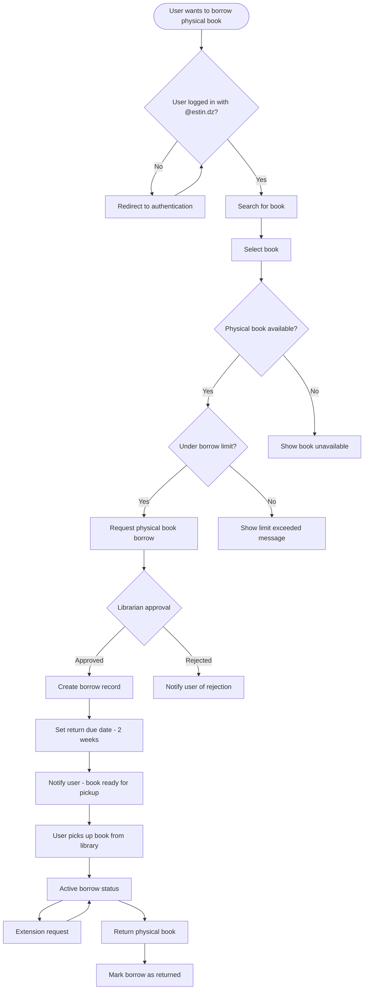

## Diagram 6 - AI Chat System Flow

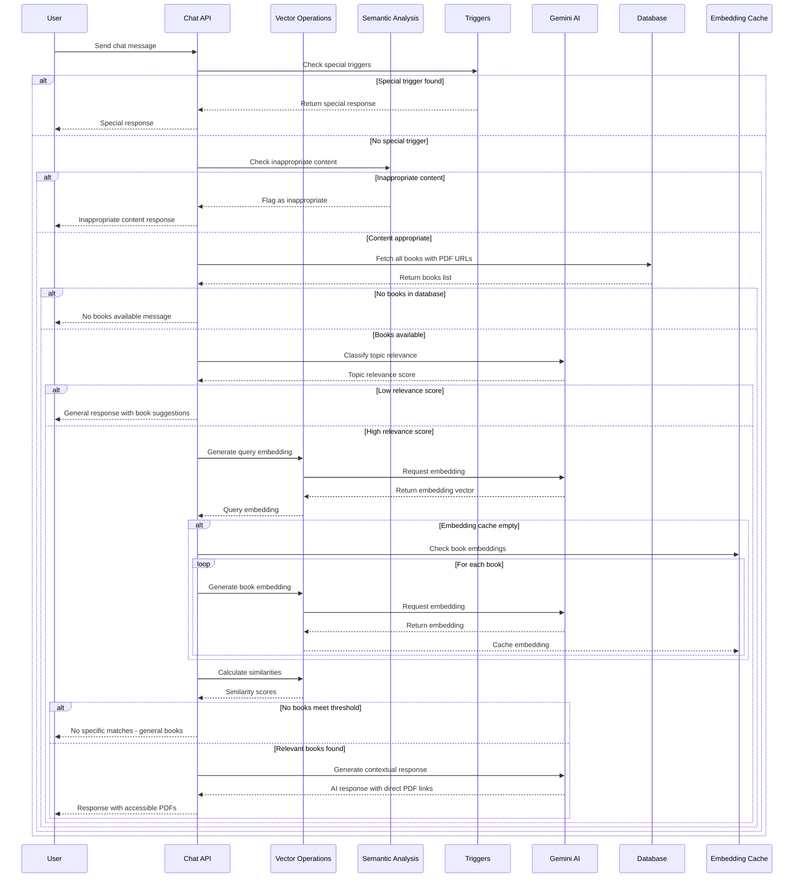

## Diagram 7 - Book Content Management System

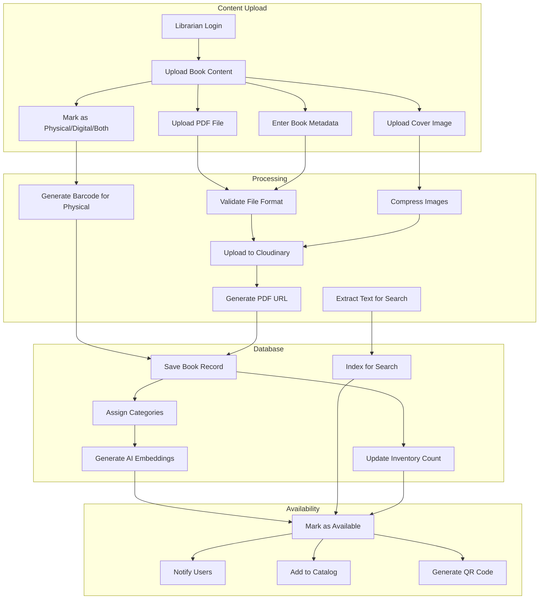

## Diagram 8 - Book Request System

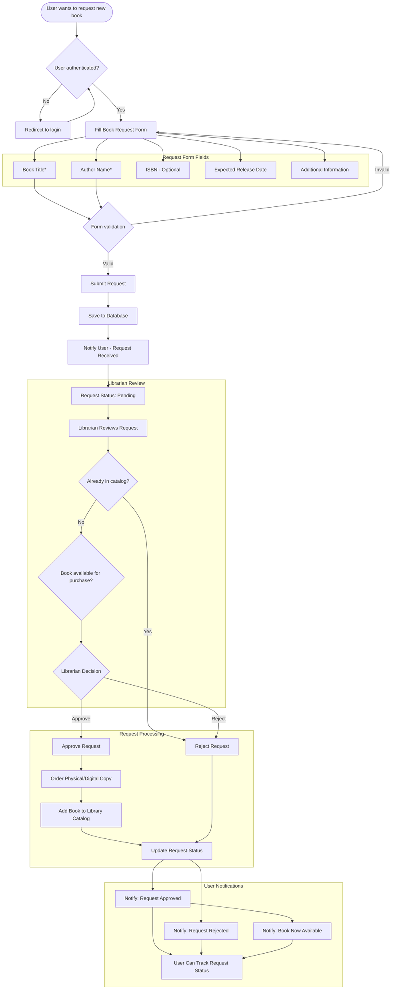

## Diagram 9 - Librarian Management Dashboard

```mermaid
flowchart TD
    subgraph "Librarian Dashboard"
        LIB_LOGIN[Librarian Login]
        LIB_OVERVIEW[Library Overview]
        MANAGE_BOOKS[Manage Books]
        MANAGE_BORROWS[Manage Borrows]
        USER_MANAGEMENT[User Management]
        REPORTS[Reports & Analytics]
        COMPLAINTS[Handle Complaints]
    end
    
    subgraph "Book Management"
        ADD_BOOK[Add New Books]
        EDIT_BOOK[Edit Book Details]
        UPLOAD_PDF[Upload PDFs]
        INVENTORY[Inventory Management]
        CATEGORIES[Manage Categories]
        AVAILABILITY[Set Availability]
    end
    
    subgraph "Borrow Management"
        PENDING_REQ[Pending Requests]
        APPROVE_BORROW[Approve Borrows]
        TRACK_RETURNS[Track Returns]
        OVERDUE[Handle Overdue]
        EXTENSIONS[Approve Extensions]
        FINES[Manage Fines]
    end
    
    subgraph "User Management"
        VIEW_USERS[View All Users]
        USER_ACTIVITY[User Activity]
        ROLE_ASSIGN[Assign Roles]
        BLOCK_USER[Block/Unblock Users]
        BORROW_LIMITS[Set Borrow Limits]
    end
    
    subgraph "Analytics"
        BORROW_STATS[Borrowing Statistics]
        POPULAR_BOOKS[Popular Books]
        USER_STATS[User Statistics]
        SYSTEM_USAGE[System Usage]
        REPORTS_GEN[Generate Reports]
    end
    
    LIB_LOGIN --> LIB_OVERVIEW
    LIB_OVERVIEW --> MANAGE_BOOKS
    LIB_OVERVIEW --> MANAGE_BORROWS
    LIB_OVERVIEW --> USER_MANAGEMENT
    LIB_OVERVIEW --> REPORTS
    LIB_OVERVIEW --> COMPLAINTS
    
    MANAGE_BOOKS --> ADD_BOOK
    MANAGE_BOOKS --> EDIT_BOOK
    MANAGE_BOOKS --> UPLOAD_PDF
    MANAGE_BOOKS --> INVENTORY
    MANAGE_BOOKS --> CATEGORIES
    MANAGE_BOOKS --> AVAILABILITY
    
    MANAGE_BORROWS --> PENDING_REQ
    MANAGE_BORROWS --> APPROVE_BORROW
    MANAGE_BORROWS --> TRACK_RETURNS
    MANAGE_BORROWS --> OVERDUE
    MANAGE_BORROWS --> EXTENSIONS
    MANAGE_BORROWS --> FINES
    
    USER_MANAGEMENT --> VIEW_USERS
    USER_MANAGEMENT --> USER_ACTIVITY
    USER_MANAGEMENT --> ROLE_ASSIGN
    USER_MANAGEMENT --> BLOCK_USER
    USER_MANAGEMENT --> BORROW_LIMITS
    
    REPORTS --> BORROW_STATS
    REPORTS --> POPULAR_BOOKS
    REPORTS --> USER_STATS
    REPORTS --> SYSTEM_USAGE
    REPORTS --> REPORTS_GEN
```

## Diagram 10 - Complaint Management System

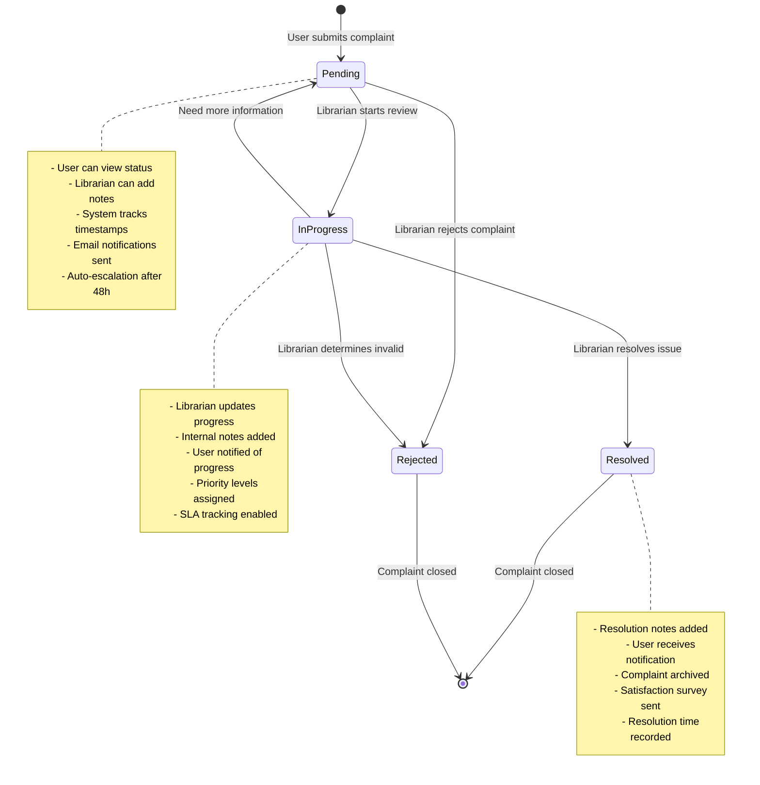

## Diagram 11 - Search and Discovery System

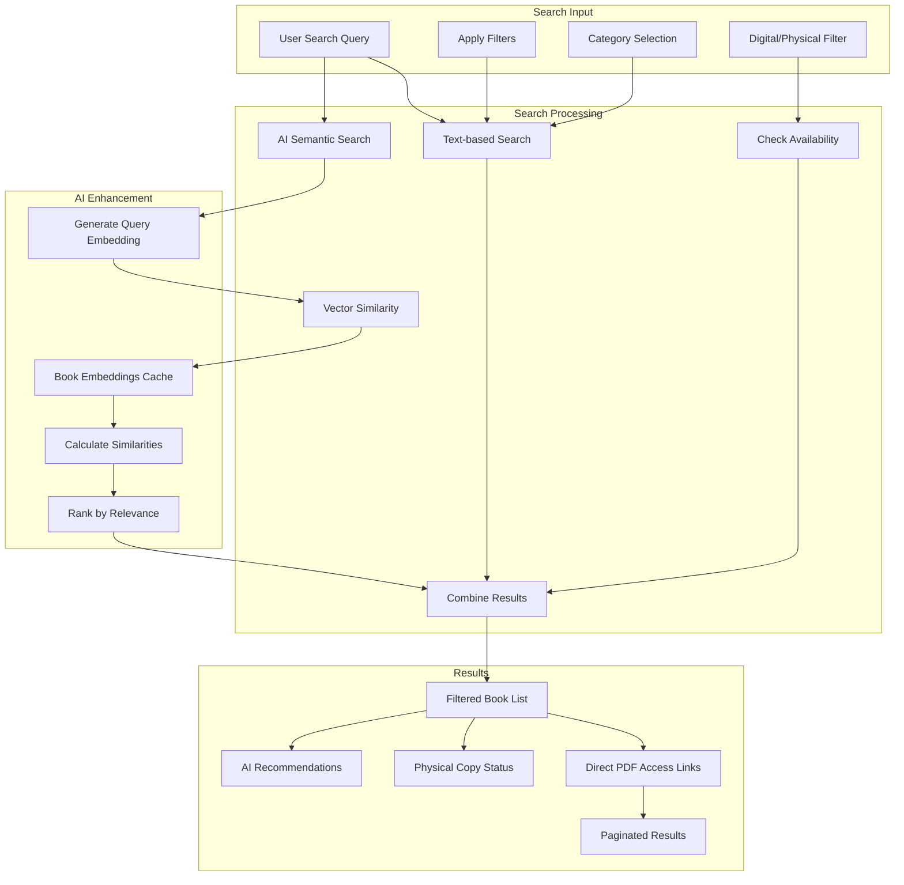

## Diagram 12 - System Deployment Architecture

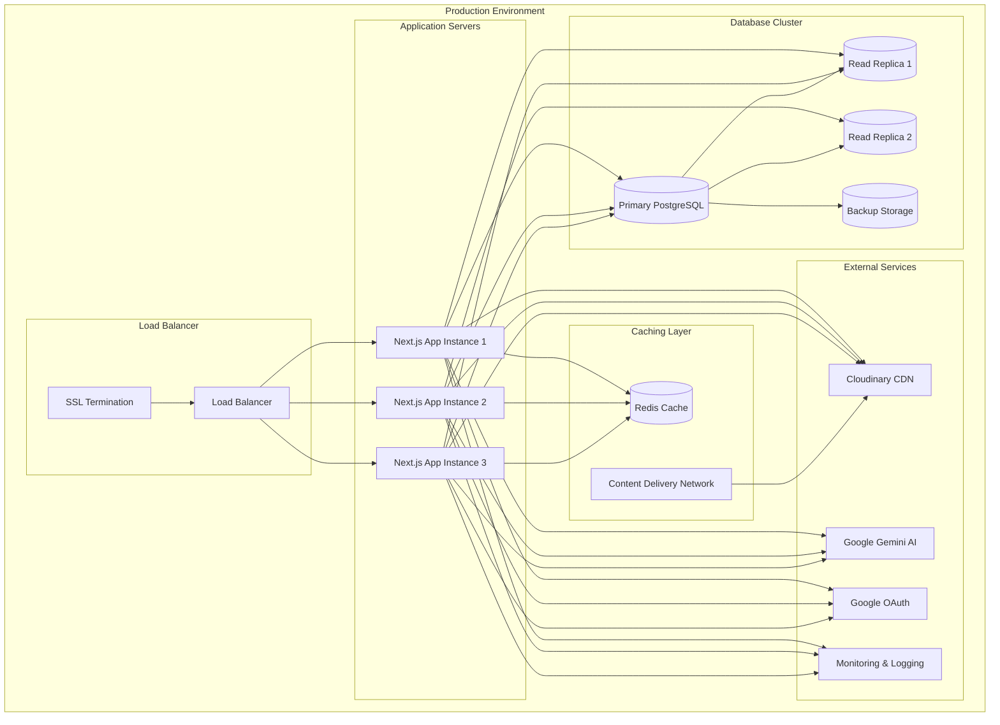

## Diagram 13 - SNDL Request System

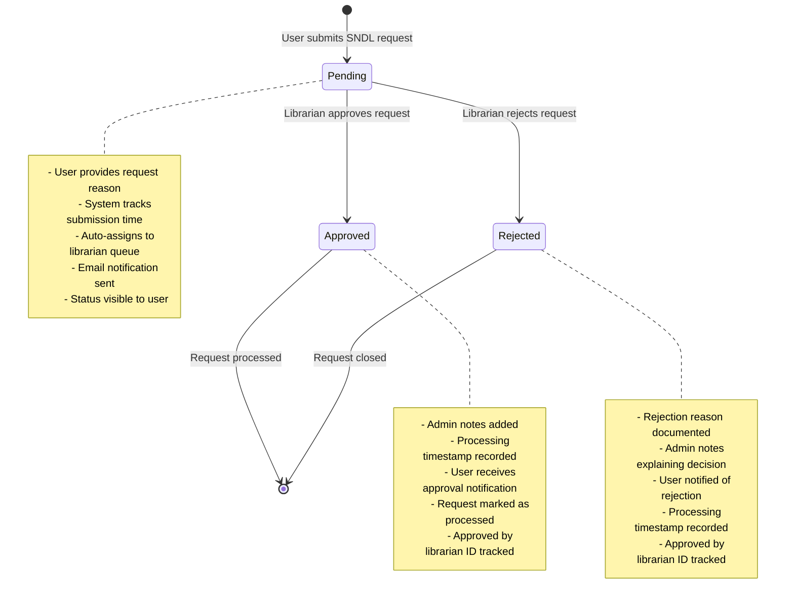

## Diagram 14 - Idea Box System

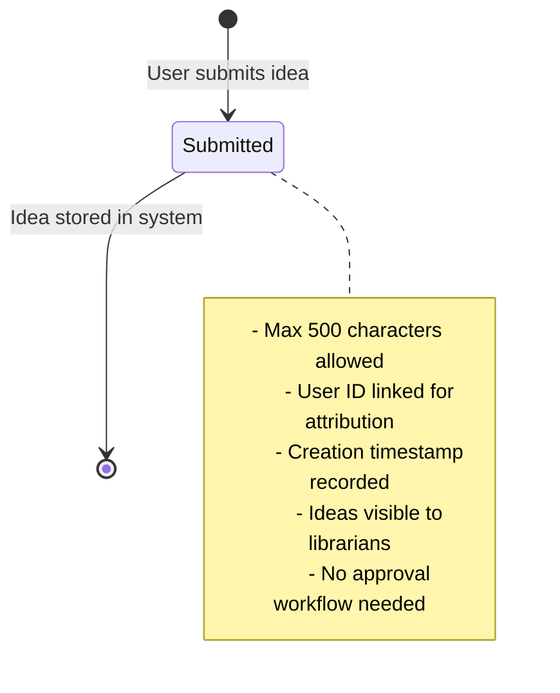

